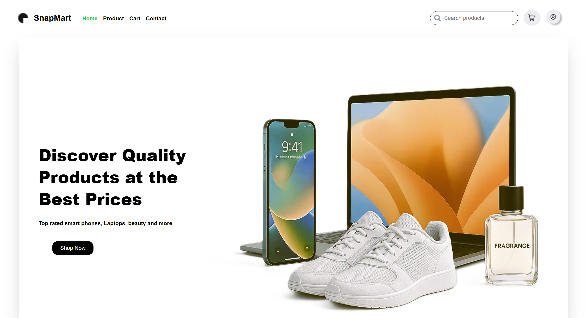
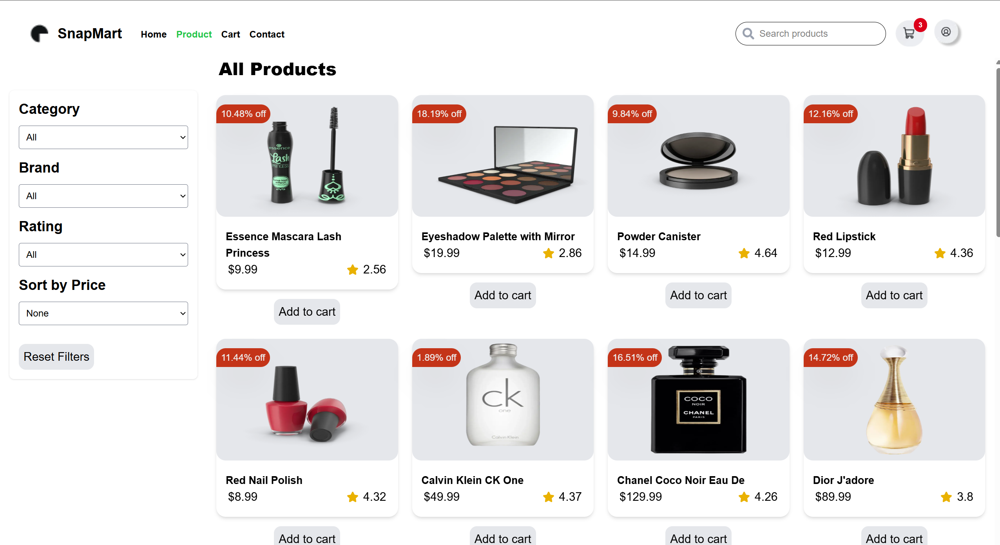

# 🛒  SnapMart

## OverView

Snapmart is a modern, scalable e-commerce web application built with Next.js and React, designed to deliver a seamless shopping experience. It leverages a robust frontend stack including Redux Toolkit, Tailwind CSS, and TypeScript to ensure maintainability, performance, and developer productivity.

 It provides a smooth online shopping experience with advanced product filtering, search functionality, and a modern responsive UI.

---

## 🚀 Features

### **Core Functionality**

- **Dynamic Product Listing** – Fetch and display products from the backend.
- **Advanced Filtering & Sorting**:

  - Filter by **Category**
  - Filter by **Brand**
  - Filter by **Rating**
  - Filter by **Price Range**
  - Sort by **Price** (Low → High / High → Low)

- **Search** – Instantly search products by name/title.
- **Add to Cart** – Save products to cart with Redux state management.

### **UI & UX**

- Fully **responsive** design for desktop, tablet, and mobile.
- **Filter Sidebar** with clickable filter options and clear filter tags.
- **Product Cards** with image, title, price, and ratings.
- **Pill-style active filters** displayed above the product list.
- **Navbar** with logo, search bar, cart icon, and login/register buttons.

---

## 🎥 Quick Demo


_Demonstration of SnapMart's product browsing, filtering, and cart features._

---

## 🏗️ Tech Stack

| Category             | Technology                 |
| -------------------- | -------------------------- |
| **Framework**        | Next.js (Pages Router)     |
| **Language**         | TypeScript                 |
| **Styling**          | Tailwind CSS               |
| **State Management** | Redux Toolkit              |
| **Icons**            | React Icons                |
| **Image Handling**   | Next.js Image Optimization |

---

## 📂 Folder Structure

```
snapmart/
├── components/           # Reusable components
│   ├── common/           # Common UI components (ProductCard, Pill, etc.)
│   ├── FilterSidebar.tsx # Sidebar for filters
│   ├── Header.tsx        # Navigation bar
│   └── ...
├── hooks/                # Custom hooks (e.g., useProductLists)
├── pages/                # Next.js pages
│   ├── index.tsx         # Home page
│   └── product/[id].tsx  # Product detail page
├── public/assets/        # Static assets (logo, images, demo GIF)
├── store/                # Redux store & slices
├── styles/               # Global styles
└── README.md
```

---

## ⚙️ Installation & Setup

### **1. Clone the repository**

```bash
git clone https://github.com/your-username/snapmart.git
cd snapmart
```

### **2. Install dependencies**

```bash
npm install
```

### **3. Create `.env.local` file**

Add your environment variables:

```env
NEXT_PUBLIC_API_URL=https://your-api-url.com
```

### **4. Run development server**

```bash
npm run dev
```

Visit **[http://localhost:3000](http://localhost:3000)** in your browser.

---

## 🛠️ Redux Store Structure

```ts
{
  filters: {
    category: string;
    brand: string;
    rating: number;
    priceRange: [number, number];
    sortOrder: 'asc' | 'desc';
  },
  search: {
    term: string;
  },
  cart: {
    items: Array<{ id: string; quantity: number; }>
  }
}
```

---

## 📌 How Filtering Works

1. User selects filter options from **FilterSidebar**.
2. Redux stores the filter state.
3. Product listing is filtered in **useProductLists** hook:

```ts
const filtered = allProducts.filter(
  (p) =>
    (!filters.category || p.category === filters.category) &&
    (!filters.brand || p.brand === filters.brand) &&
    p.rating >= filters.rating &&
    p.price >= filters.priceRange[0] &&
    p.price <= filters.priceRange[1] &&
    p.title.toLowerCase().includes(searchTerm.toLowerCase())
);
```

4. Sorted by **price order** before rendering.

---

## 📸 Screenshots

### Home Page



### Product Filters



---

## 🧩 Future Enhancements

- User authentication & profiles
- Persistent cart using with buy now
- Wishlist feature
- Payment integration (Stripe/PayPal)
- Backend API with database

---

## 👨‍💻 Author

**Latera Mekonnen**
